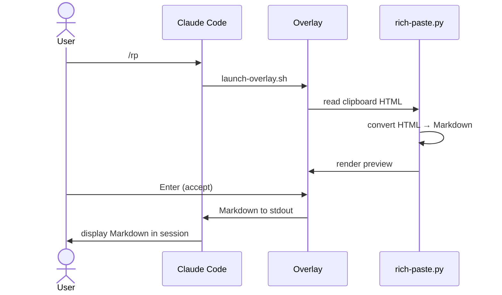
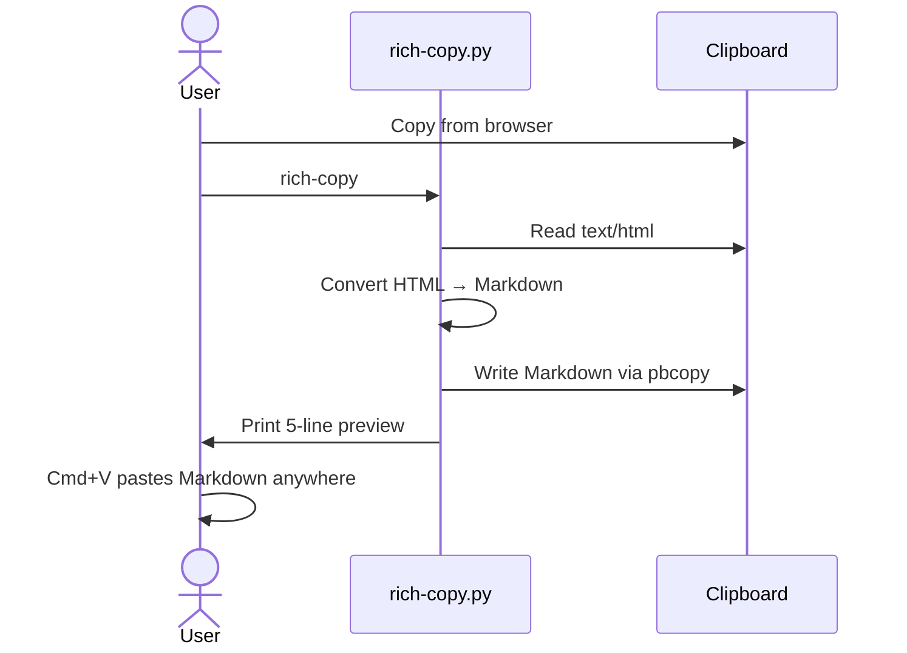

# rich-paste — Use Case Document

## Overview

rich-paste converts clipboard HTML to Markdown, preserving links, formatting, and structure that regular paste destroys. It operates as a Claude Code skill, standalone CLI, and kitty terminal hotkey.

**Primary problem:** When you copy text from a browser, ChatGPT, or Google Docs, pasting into a terminal gives plain text only — all hyperlinks and formatting are lost.

## Actors

| Actor | Description |
|-------|-------------|
| **User** | Developer using Claude Code, terminal, or SSH session |
| **Claude Code** | AI coding assistant that invokes `/rp` skill |
| **Clipboard** | OS clipboard containing `text/html` and `text/plain` formats |
| **Overlay** | Terminal overlay (tmux popup / kitty overlay / wezterm split-pane) |

---

## Use Cases

### UC-1: Rich Paste via Claude Code Skill

**Goal:** Paste web content into a Claude Code session with links and formatting preserved.

**Trigger:** User runs `/rp` or `/rich-paste` in Claude Code.

**Preconditions:**
- `uv` is installed
- Terminal supports overlays (tmux, kitty, or wezterm)
- Clipboard contains HTML content

**Flow:**

| Step | Action |
|------|--------|
| 1 | User copies rich text from browser / ChatGPT / Google Docs |
| 2 | User runs `/rp` in Claude Code |
| 3 | `launch-overlay.sh` opens a terminal popup |
| 4 | `rich-paste.py` reads `text/html` from clipboard via OS API |
| 5 | HTML is converted to Markdown (ATX headings, `-` bullets, `**bold**`) |
| 6 | Preview is displayed in the overlay |
| 7 | User presses **Enter** to accept |
| 8 | Markdown is written to temp file, read by Claude Code, presented in session |

**Alternative flows:**

| Variant | Condition | Behavior |
|---------|-----------|----------|
| Cancel | User presses **q** or **Esc** | Overlay closes, nothing is pasted |
| Re-read | User presses **r** | Clipboard is re-read and preview refreshed |
| No HTML | Clipboard has plain text only | Plain text fallback shown (see UC-4) |
| Empty clipboard | Clipboard is empty | "Clipboard is empty" message, user can re-read or cancel |

---

### UC-2: No-Preview Mode (Instant Conversion)

**Goal:** Convert clipboard HTML to Markdown instantly without interactive preview.

**Trigger:** User runs `/rp --no-preview` in Claude Code.

**Flow:**

| Step | Action |
|------|--------|
| 1 | User runs `/rich-paste --no-preview` |
| 2 | `rich-paste.py` reads clipboard HTML |
| 3 | Converts to Markdown and writes directly to output file |
| 4 | Result returned to Claude Code — no overlay opened |

**When to use:** Automation, scripting, or when the user trusts the conversion result.

---

### UC-3: Manual HTML Input

**Goal:** Convert raw HTML when clipboard is not available (e.g., SSH session).

**Trigger:** User runs `/rp --manual` in Claude Code.

**Flow:**

| Step | Action |
|------|--------|
| 1 | User runs `/rich-paste --manual` |
| 2 | Overlay opens with "Paste HTML below, then press Ctrl-D" prompt |
| 3 | User pastes raw HTML into stdin |
| 4 | HTML is converted to Markdown and preview shown |
| 5 | User accepts or cancels |

**When to use:** Remote sessions without clipboard access, or converting HTML from a file.

---

### UC-4: Plain Text Fallback

**Goal:** Handle clipboard that contains plain text but no HTML.

**Trigger:** Automatic — when `/rp` detects no `text/html` in clipboard.

**Flow:**

| Step | Action |
|------|--------|
| 1 | `rich-paste.py` reads clipboard — no HTML found |
| 2 | Falls back to plain text (`pbpaste` on macOS, `xclip -o` on Linux) |
| 3 | Shows plain text preview (first 500 chars) with "No HTML found" warning |
| 4 | User can press **Enter** to use as-is, **r** to re-read, or **q** to cancel |

---

### UC-5: Rich Copy CLI (Clipboard-to-Clipboard)

**Goal:** Convert clipboard HTML to Markdown in-place, so regular Cmd+V pastes Markdown.

**Trigger:** User runs `rich-copy` in terminal.

**Flow:**

| Step | Action |
|------|--------|
| 1 | User copies rich text from any source |
| 2 | User runs `rich-copy` in terminal |
| 3 | Script reads HTML from clipboard |
| 4 | Converts to Markdown |
| 5 | Writes Markdown back to clipboard via `pbcopy` |
| 6 | Shows 5-line preview in terminal |
| 7 | User can now Cmd+V in any app — Markdown with links is pasted |

**When to use:** Before pasting into SSH sessions, Slack, plain text editors, or any context where you want `[links](url)` preserved.

**Error:** If no HTML in clipboard → exits with "No HTML in clipboard — nothing to convert".

---

### UC-6: Kitty Hotkey (Cmd+Shift+V)

**Goal:** One-keystroke rich paste in kitty terminal — converts HTML and pastes Markdown.

**Trigger:** User presses **Cmd+Shift+V** in kitty.

**Preconditions:**
- `rich_paste.py` kitten installed in `~/.config/kitty/`
- `map cmd+shift+v kitten rich_paste.py` in `kitty.conf`
- `uv` and `rich-paste.py` script accessible

**Flow:**

| Step | Action |
|------|--------|
| 1 | User copies from browser |
| 2 | User presses **Cmd+Shift+V** in kitty |
| 3 | Kitten reads HTML from clipboard via kitty's native MIME API (`boss.clipboard`) |
| 4 | HTML is piped to `rich-paste.py --manual --no-preview` for Markdown conversion |
| 5 | Markdown is pasted into the active kitty window via `w.paste_text()` |

**Key property:** Works in SSH sessions — conversion happens locally on the Mac before text reaches the remote terminal. No clipboard round-trip — HTML is read natively and Markdown is pasted directly.

**Fallback:** If no HTML in clipboard, kitten reads plain text via `boss.clipboard.get_text()` and pastes as-is.

---

### UC-7: SSH Session Workflow

**Goal:** Paste rich content into a remote SSH session with links preserved.

**Trigger:** User is in an SSH session and needs to paste formatted content.

**Flow A — Kitty hotkey (preferred):**

| Step | Action |
|------|--------|
| 1 | User copies from browser on local Mac |
| 2 | Presses Cmd+Shift+V in kitty SSH session |
| 3 | Local kitten converts HTML → Markdown and pastes |

**Flow B — rich-copy + regular paste:**

| Step | Action |
|------|--------|
| 1 | User copies from browser |
| 2 | Runs `rich-copy` in a local terminal |
| 3 | Switches to SSH session |
| 4 | Regular Cmd+V pastes Markdown |

**Flow C — Claude Code remote (no clipboard):**

| Step | Action |
|------|--------|
| 1 | User runs `/rp` in remote Claude Code session |
| 2 | Skill detects no clipboard available (no DISPLAY, no WAYLAND_DISPLAY) |
| 3 | Tells user to paste content directly via Cmd+V |
| 4 | User pastes plain text (links lost but content preserved) |

---

### UC-8: Multi-Terminal Overlay Support

**Goal:** Show preview overlay in whichever terminal the user runs.

**Resolution order in `launch-overlay.sh`:**

| Priority | Terminal | Detection | Overlay Type |
|----------|----------|-----------|-------------|
| 1 | tmux | `$TMUX` set | `tmux display-popup` |
| 2 | kitty | `$KITTY_LISTEN_ON` set | `kitty @ launch --type=overlay` |
| 3 | wezterm | `$WEZTERM_PANE` set | `wezterm cli split-pane` |
| 4 | fallback | none detected | `--no-preview` mode (direct stdout) |

Overlay dimensions are configurable via `RICH_PASTE_POPUP_WIDTH` and `RICH_PASTE_POPUP_HEIGHT` environment variables (default: 80% × 70%).

---

### UC-9: Linux Clipboard Support

**Goal:** Read HTML from clipboard on Linux desktops.

**Resolution order:**

| Priority | Display Server | Tool | Command |
|----------|---------------|------|---------|
| 1 | X11 | xclip | `xclip -selection clipboard -t text/html -o` |
| 2 | X11 | xsel | `xsel --clipboard --output` (checks for `<` prefix) |
| 3 | Wayland | wl-paste | `wl-paste --type text/html` |

Falls back to plain text if no HTML format available. Returns empty string if no clipboard tool is present.

---

## Summary Matrix

| Use Case | Entry Point | Requires Overlay | Platform | Interactive |
|----------|-------------|-----------------|----------|-------------|
| UC-1: Rich Paste | `/rp` in Claude Code | Yes | macOS, Linux | Yes |
| UC-2: No-Preview | `/rp --no-preview` | No | macOS, Linux | No |
| UC-3: Manual HTML | `/rp --manual` | Yes | Any | Yes |
| UC-4: Plain Fallback | Auto (no HTML) | Yes | macOS, Linux | Yes |
| UC-5: Rich Copy CLI | `rich-copy` | No | macOS | No |
| UC-6: Kitty Hotkey | Cmd+Shift+V | No | macOS | No |
| UC-7: SSH Workflow | Various | Depends | macOS → remote | Depends |
| UC-8: Multi-Terminal | Auto | Yes | macOS, Linux | Yes |
| UC-9: Linux Clipboard | Auto | N/A | Linux | N/A |
